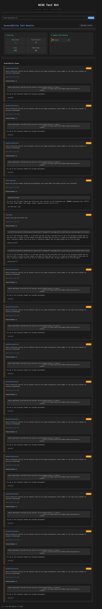

# WCAG Test Bot

A powerful web accessibility testing tool that crawls websites and performs automated WCAG 2.1 compliance checks using Playwright and axe-core.

## About

This project was created as a learning exercise to understand web accessibility testing and crawling techniques. It implements a web crawler integrated with [axe-core](https://github.com/dequelabs/axe-core).
The main learning objectives were to:
- Understand how web crawlers work
- Learn about automated accessibility testing
- Gain experience with axe-core integration
- Practice building real-time progress tracking

The crawler is built with Playwright for robust web navigation and uses axe-core's comprehensive ruleset to detect accessibility violations.

## Features

- 🔍 Recursive web crawling with configurable depth
- ⚡ Concurrent page analysis with rate limiting
- 📊 Real-time progress tracking via WebSocket
- 📝 Detailed WCAG violation reporting
- 📱 Responsive web interface


## Screenshot



## Tech Stack

- **Frontend**: React + TypeScript + Vite
- **Backend**: Node.js + Express
- **Testing Engine**: Playwright + axe-core
- **Real-time Updates**: WebSocket
- **Build Tools**: TypeScript, ESLint

## Project Structure

```
test-bot/
├── api/                  # Backend server
│   ├── src/
│   │   ├── services/    # Core services
│   │   └── types/       # Type definitions
│   └── package.json
├── client/              # React frontend
│   ├── src/
│   │   ├── components/
│   │   ├── services/
│   │   └── types/
│   └── package.json
└── package.json         # Root package.json
```


## Docker Setup

### Prerequisites

- Docker
- Docker Compose

### Running with Docker

1. Build and start the containers:

```bash
docker compose up --build
```


2. Access the application:
- Frontend: `http://localhost:5173`
- API: `http://localhost:3000`

#### Viewing Container Logs

To view logs for specific containers:

- View API container logs

```bash
docker compose logs api -f
```

- View Client container logs

```bash
docker compose logs client -f
```

- View all container logs

```bash
docker compose logs -f
```


